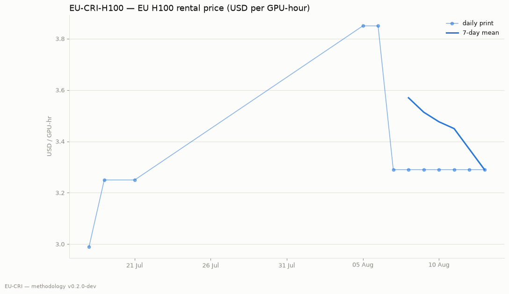
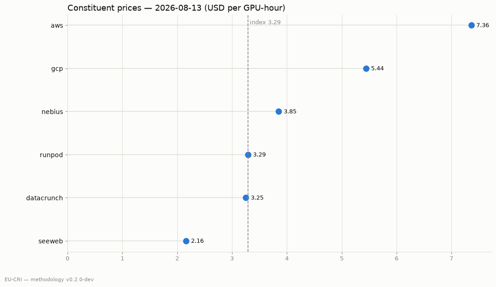

# EU-CRI weekly — 2026-08-13

**EU-CRI-H100: $3.29 / GPU-hour** (€2.85 at ECB 1.1545 on 2026-08-12)

Week-over-week: -14.5% · Month-over-month: n/a · Constituents: 6 (1 executable-quote)

7-day mean: $3.29

<!-- EDITORIAL: lead commentary -->

Dispersion: cheapest constituent $2.16, dearest $7.36 — a 3.4x spread for the same reference unit.

| provider | tier | $/GPU-hr | weight |
|---|---|---|---|
| seeweb | list | $2.16 | 15 |
| datacrunch | list | $3.25 | 15 |
| runpod | executable | $3.29 | 23 |
| nebius | list | $3.85 | 15 |
| gcp | list | $5.44 | 15 |
| aws | list | $7.36 | 15 |

<!-- EDITORIAL: energy overlay comment -->

---

*Methodology v0.2.0-dev — full methodology, constituent-level audit trail, and source code are public in the repository. Corrections are published as flagged revisions, never silently.*

*EU-CRI is a research publication. It is not investment advice and is not administered as a benchmark under EU Regulation 2016/1011; it may not be used as a reference price in financial instruments.*
